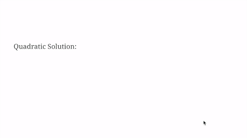
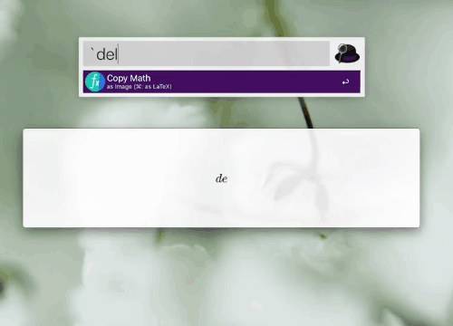

# AsciiMath for Alfred
An [Alfred 4](https://alfredapp.com) workflow that
renders math as you type and lets you copy the PNG and LaTeX.

### Motivation
My fashcard software supports neither LaTeX nor MathML.
Given that image is the only way to go, I created this workflow.
 
### Setup
 1. Download the [latest release](https://github.com/mr-pennyworth/alfred-asciimath/releases/latest/download/AsciiMath.alfredworkflow).
 2. Type `.asciimath-init` in Alfred.

### Permissions explanation
The accessibility permission is needed so that the math window
can automatically close if you press `escape` to exit Alfred
without either copying the image or the LaTeX.

### Usage instructions
 1. Open Alfred
 2. Type <code>`</code> (backtick)
 3. Start typing a math expression in AsciiMath syntax.
 4. As soon as you start typing, another window opens and
    it displays the typesetted math in real time as you type.
 5. Pressing `enter` closes both alfred and the math window,
    and puts a PNG image into clipboard.
 6. Instead of pressing enter, if you pressed `command + enter`,
    it copies LaTeX instead of the image to clipboard.

### Built-in reference
If you are stuck in middle of typing, just stop, hit shift,
and it'll pop up a reference. When done consulting the reference,
hit escape, and start typing from where you left off!  

### Icon credits
Icon by [Freepik](http://www.freepik.com/)
from [Flaticon](https://www.flaticon.com/)
